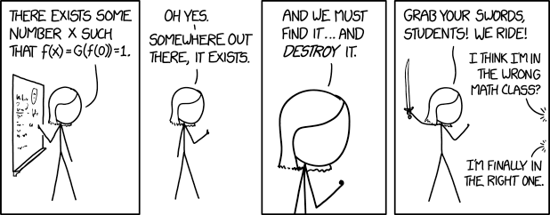

```{r setup, include = FALSE}
library(knitr)
library(tidyverse)
library(NHSRtheme)
# set default options
opts_chunk$set(echo = FALSE,
               fig.width = 7.252,
               fig.height = 4,
               dpi = 300)

# uncomment the following lines if you want to use the NHS-R theme colours by default
# scale_fill_continuous <- partial(scale_fill_nhs, discrete = FALSE)
# scale_fill_discrete <- partial(scale_fill_nhs, discrete = TRUE)
# scale_colour_continuous <- partial(scale_colour_nhs, discrete = FALSE)
# scale_colour_discrete <- partial(scale_colour_nhs, discrete = TRUE)
```

class: title-slide, left, bottom

# `r rmarkdown::metadata$title`
----
## **`r rmarkdown::metadata$subtitle`**
### `r rmarkdown::metadata$author`
### `r rmarkdown::metadata$date`

---

# Pedagogic Context

.pull-left[

.pink[**Transition to level 2 mathematics**]

  - abstract and formal
  - retention and progression issue for some
  - possibly exacerbated by COVID pandemic
]
.pull-right[  
  ```{r proofs, echo = FALSE, fig.align='center', out.width='100%'}
knitr::include_graphics("proofs.png")
```
]

--

.green[**Co-creation pedagogy**]
  - including student in the design of the curriculum
    - student-centered pedagogic approach

--

.green[**Use of examples in mathematical education**]
  - benefits of doing and creating examples and counter-examples
    - participate to the construction of _concept image_

---

# Linear Algebra Course

.center[.green[**Could we use co-creation to help transition to level 2 mathematics courses?**]]

--

.pull-left[

- Two linear algebra courses in year 2 at UoA: 
  - 35 registered students on semester 1 course: 75% in Natural and Computing Science degrees
  - 31 of those also took the semester 2 course
  
]

.pull-right[

]

---

# Linear Algebra Course

- .green[Called for volunteers in semester 1 to work in January/Fberuary 2023 (between the 2 semesters) in small groups to:]
  - identified difficult linear algebra topics;
  - create tutorial style questions and problems on these topics;
  - code them in NUMBAS.
  
--

- .green[Intention was to collect feedback on experience of co-creation in groups:]
  - impact on motivation and confidence in linear algebra using questionnaires and interview;
  - impact on marks.
  
--

Due to PGCert timeline, the ethics application was only completed at the end of November 2022.
  
---

# Experiment

.pink[Only one student came forward ...]

.pull-left[
The project ran between 02 February and 15 March 2023.

We met weekly to monitor progress and ran a focused interview on 15 March.

Interview conversation is analysed using Interpretative Phenomenological Analysis (IPA).
]

.pull-right[
```{r IPA, echo = FALSE, fig.align='center', out.width='30%', fig.cap='IPA process'}
knitr::include_graphics("IPA.png")
```
]

---
class: middle, center

# Focus Interview Results

.left[

.green[**A positive experience ...**]

 Improved motivation, focus and independence;
 
 Improved and consolidated understanding of linear algebra;
 
 Improved confidence in ability and confidence.
]

.right[
.pink[**... But some limitations**]

 Group work would have been nice: .pink[developing a community of learners];
 
 Activity should have run alongside the course.
]
---
class: middle, center

# Future Plans

--

GMJT proposal with Emma Coutts for pair-work and for analysis of benfits of student-created examples for users.

--

Run the activity again alongside Linear Algebra I: create discipline-specific examples.

--

Investigate the possibility of organising similar activities for Analysis.

--



---
class: middle, center

# Thanks for listening !

`r fontawesome::fa("face-smile")`

