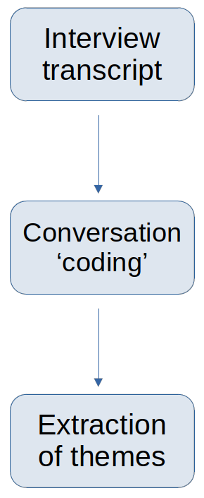

```{r setup, include=FALSE}
options(htmltools.dir.version = FALSE)
knitr::opts_chunk$set(
  fig.width=9, fig.height=3.5, fig.retina=3,
  out.width = "100%",
  cache = FALSE,
  echo = TRUE,
  message = FALSE, 
  warning = FALSE,
  hiline = TRUE
)
```

```{r xaringan-themer, include=FALSE, warning=FALSE}
library(xaringanthemer)
style_duo_accent(
  primary_color = "#1381B0",
  secondary_color = "#FF961C",
  inverse_header_color = "#FFFFFF"
)
```

# Pedagogic Context

- Transition to level 2 mathematics
  - abstract and formal
  - retention and progression issue for some
  - possibly exacerbated by COVID pandemic
  
--

- Co-creation pedagogy
  - including student in the design of the curriculum
  
--

- Use of examples in mathematical education
  - benefits of doing and creating examples and counter-examples
  
---

# Linear Algebra Course

## Could we use co-creation to help transition to level 2 mathematics courses?

--

.pull-left[

- Two linear algebra courses in year 2 at UoA: 
  - 35 registered students on semester 1 course: 75% in Natural and Computing Science degrees
  - 31 of those also took the semester 2 course
  
]

.pull-right[

]

---

# Linear Algebra Course

- Called for volunteers in semester 1 to work in January/Fberuary 2023 (between the 2 semesters) in small groups to:
  - identified difficult linear algebra topics;
  - create tutorial style questions and problems on these topics;
  - code them in NUMBAS.
  
--

- Intention was to collect feedback on experience of co-creation in groups:
  - impact on motivation and confidence in linear algebra;
  - impact on marks.
  
---

# Focus Interview Results

Only one student came forward ...

.pull-left[
The project ran between 02 February and 15 March 2023.

We met weekly to monitor progress and ran a focused interview on 15 March.

Interview conversation is analysed using Interpretative Phenomenological Analysis (IPA).
]

.pull-right[
```{r IPA, echo = FALSE, fig.align='center', out.width='30%', fig.cap='IPA process'}

```
]


---

# Future Plans